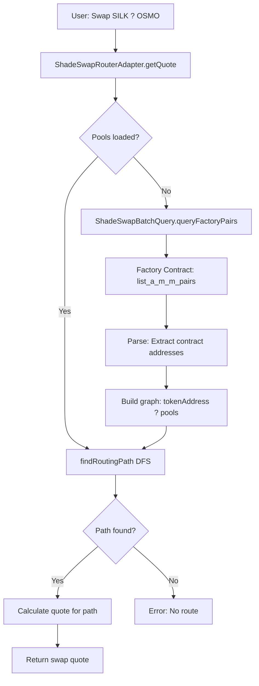

# ShadeSwap Routing Architecture

## ?? Resumo Executivo

Esta documentação explica como implementamos o routing de swaps no ShadeSwap, **baseado 100% na arquitetura oficial do ShadeJS**.

### Problema Original
- ? Tentámos usar **UUIDs do GraphQL** como identificadores de tokens
- ? GraphQL tem dados limitados e não suporta todos os pools
- ? UUIDs são **internos** ao sistema do ShadeSwap, não são addresses blockchain

### Solução Implementada
- ? Usar **CONTRACT ADDRESSES** (e.g., `secret1...`) como identificadores
- ? Query **on-chain** ao Factory contract para obter lista completa de pools
- ? Construir grafo de routing com addresses nativos
- ? Algoritmo DFS (Depth-First Search) para encontrar caminhos

---

## ??? Arquitetura (baseada no ShadeJS)

### 1. Fonte de Dados: Factory Contract (On-Chain)

```typescript
// Query ao Factory contract
const factoryPairs = await queryFactoryPairs({
  startingIndex: 0,
  limit: 300,
});

// Retorna:
[
  {
    pairContract: { address: "secret1abc...", codeHash: "..." },
    token0Contract: { address: "secret1xyz...", codeHash: "..." }, // ? CONTRACT ADDRESS
    token1Contract: { address: "secret1def...", codeHash: "..." }, // ? CONTRACT ADDRESS
    isStable: false,
    isEnabled: true,
  },
  // ...
]
```

**Porquê on-chain e não GraphQL?**
- ? Dados completos e sempre atualizados
- ? Contract addresses nativos (não precisam de mapping)
- ? Nenhuma dependência de serviços externos
- ? Mesma fonte de verdade que o ShadeSwap frontend oficial

---

### 2. Estrutura do Grafo de Routing

```typescript
// Graph structure: Map<tokenAddress, pools[]>
poolsGraph = {
  "secret1fl449muk5yq8dlad7a22nje4p5d2pnsgymhjfd": [ // SILK
    { poolAddress: "secret1abc...", token0: "SILK", token1: "sSCRT", ... },
    { poolAddress: "secret1def...", token0: "SILK", token1: "USDC", ... },
  ],
  "secret1k0jntykt7e4g3y88ltc60czgjuqdy4c9e8fzek": [ // sSCRT
    { poolAddress: "secret1abc...", token0: "SILK", token1: "sSCRT", ... },
    { poolAddress: "secret1ghi...", token0: "sSCRT", token1: "OSMO", ... },
  ],
  "secret1zwwealwm0pcl9cul4nt6f38dsy6vzplw8lp3qg": [ // OSMO
    { poolAddress: "secret1ghi...", token0: "sSCRT", token1: "OSMO", ... },
  ],
}
```

**Cada token address aponta para os pools onde participa.**

---

### 3. Algoritmo de Routing: DFS (Depth-First Search)

```typescript
function findRoutingPath(startToken: string, endToken: string, maxHops: number) {
  // Stack for iterative DFS
  stack = [{ tokenAddress: startToken, depth: 0, path: [], visited: new Set() }];

  while (stack.length > 0) {
    const { tokenAddress, depth, path, visited } = stack.pop();

    // Check if reached destination
    if (tokenAddress === endToken && path.length > 0) {
      return path; // Found a path!
    }

    // Check max hops
    if (depth > maxHops) continue;

    // Explore neighbors
    const neighbors = poolsGraph.get(tokenAddress);
    for (const pool of neighbors) {
      const nextToken = getOtherToken(pool, tokenAddress);
      
      if (!visited.has(nextToken)) {
        stack.push({
          tokenAddress: nextToken,
          depth: depth + 1,
          path: [...path, pool],
          visited: new Set([...visited, nextToken]),
        });
      }
    }
  }

  return []; // No path found
}
```

**Exemplo de routing SILK ? OSMO:**
```
Path encontrado:
1. Start: SILK (secret1fl44...)
2. Pool 1: SILK/sSCRT (secret1abc...)
3. Intermediate: sSCRT (secret1k0jn...)
4. Pool 2: sSCRT/OSMO (secret1ghi...)
5. End: OSMO (secret1zwwe...)

Route: [Pool SILK/sSCRT, Pool sSCRT/OSMO]
```

---

## ?? Estrutura de Ficheiros

```
apps/web/services/dex/
??? ShadeSwapBatchQuery.ts          # Query on-chain ao Factory contract
??? adapters/
?   ??? ShadeSwapRouterAdapter.ts   # Routing logic com DFS (NOVO)
?   ??? ShadeSwapGraphQLAdapter.ts  # Direct pool queries (fallback)
??? TokenRegistry.ts                # Token metadata (symbols, addresses, etc)
```

### Responsabilidades

#### `ShadeSwapBatchQuery.ts`
- Query ao Factory contract: `list_a_m_m_pairs`
- Parse factory pairs response
- Retorna `FactoryPair[]` com contract addresses

#### `ShadeSwapRouterAdapter.ts` (NOVO)
- Carrega pools via `ShadeSwapBatchQuery`
- Constrói grafo: `tokenAddress ? [pools]`
- Implementa DFS para routing
- Calcula quotes para multi-hop swaps

#### `ShadeSwapGraphQLAdapter.ts`
- Fallback para queries diretas a pools específicos
- Usado quando já sabemos o pool exato
- Não usado para routing (GraphQL não tem dados completos)

---

## ?? Fluxo de Execução

### Swap SILK ? OSMO



### Detalhes do DFS

```
1. Start: SILK (secret1fl44...)
   ?? Neighbors: [Pool SILK/sSCRT, Pool SILK/USDC]

2. Explore: Pool SILK/sSCRT
   ?? Next token: sSCRT (secret1k0jn...)
   ?? Neighbors: [Pool sSCRT/OSMO, Pool sSCRT/USDT]

3. Explore: Pool sSCRT/OSMO
   ?? Next token: OSMO (secret1zwwe...)
   ?? DESTINATION REACHED! ?

Path: [SILK/sSCRT, sSCRT/OSMO]
```

---

## ?? Testing

### 1. Verificar Factory Query

```bash
cd apps/web
npm run discover-pools
```

Deve mostrar:
```
?? Loading pools from Factory contract...
?? Factory returned 150 pools
? Built graph: 45 unique tokens, 150 pools
   Token secret1fl44... (SILK) has 8 pool(s)
   Token secret1k0jn... (sSCRT) has 42 pool(s)
   Token secret1zwwe... (OSMO) has 12 pool(s)
```

### 2. Testar Routing

```bash
cd apps/web
npm run test-routing -- SILK OSMO
```

Deve mostrar:
```
?? DFS: Finding path from SILK to OSMO...
? Found path with 2 hop(s)
   Hop 1: SILK/sSCRT pool
   Hop 2: sSCRT/OSMO pool
? Best path: 2 hops
```

---

## ?? Vantagens da Solução

### vs GraphQL
| Aspecto | GraphQL | On-Chain Factory |
|---------|---------|------------------|
| **Completude** | ? Limitado | ? Todos os pools |
| **Identificadores** | ? UUIDs internos | ? Contract addresses |
| **Atualização** | ? Pode estar desatualizado | ? Sempre atual |
| **Dependências** | ? Serviço externo | ? Apenas blockchain |
| **Compatibilidade** | ? Schema pode mudar | ? Contract estável |

### vs Hardcoded Pools
| Aspecto | Hardcoded | Dynamic Loading |
|---------|-----------|-----------------|
| **Manutenção** | ? Manual | ? Automático |
| **Novos pools** | ? Requer código | ? Deteta automaticamente |
| **Escalabilidade** | ? Não escala | ? Escala perfeitamente |

---

## ?? Próximos Passos

### Fase 1: ? Core Routing (COMPLETO)
- [x] Query on-chain factory
- [x] Build graph com contract addresses
- [x] DFS para path finding

### Fase 2: Quote Calculation (TODO)
- [ ] Calcular output amount para cada hop
- [ ] Simular swaps (usando pair contract queries)
- [ ] Calcular price impact
- [ ] Comparar múltiplos paths

### Fase 3: Optimização (TODO)
- [ ] Cache de pools (TTL 5min)
- [ ] Parallel path exploration
- [ ] Gas estimation
- [ ] Slippage calculation

### Fase 4: Multi-Route Aggregation (TODO)
- [ ] Split orders across multiple paths
- [ ] Optimize for best price
- [ ] Minimize price impact

---

## ?? Referências

### ShadeJS (SDK Oficial)
- **Router Logic**: `src/lib/swap/v2/routeCalculator/SwapRoutesCalculator.ts`
- **Factory Query**: `src/contracts/services/swap.ts`
- **Types**: `src/types/swap/router.ts`

### Secret Network
- **Factory Contract**: `secret1ja0hcwvy76grqkpgwznxukgd7t8a8anmmx05pp`
- **Query Msg**: `{ list_a_m_m_pairs: { pagination: { start: 0, limit: 300 } } }`

---

## ?? Troubleshooting

### "No routing path found"
**Causa**: Token não existe no grafo ou não há pools conectando os tokens.

**Solução**:
1. Verificar que ambos os tokens têm `contractAddress` no TokenRegistry
2. Verificar que existem pools no Factory para esses tokens
3. Aumentar `maxHops` se o path é muito longo

### "Factory query failed: unknown request"
**Causa**: Mensagem da query incorreta.

**Solução**:
- Verificar que está a usar `list_a_m_m_pairs` (com underscores `a_m_m`)
- Verificar code hash do Factory contract

### "Token not in graph"
**Causa**: Token existe no TokenRegistry mas não tem pools no ShadeSwap.

**Solução**:
- Verificar no ShadeSwap.com se esse token tem liquidity
- Pode ser um token novo sem pools ainda

---

## ?? Contribuições

Ao modificar o routing:
1. **SEMPRE** seguir a arquitetura do ShadeJS
2. Manter compatibilidade com contract addresses
3. Testar com swaps reais antes de commit
4. Documentar mudanças neste ficheiro

---

**Última atualização**: 2024
**Versão**: 2.0 (Refactor completo para contract addresses)
